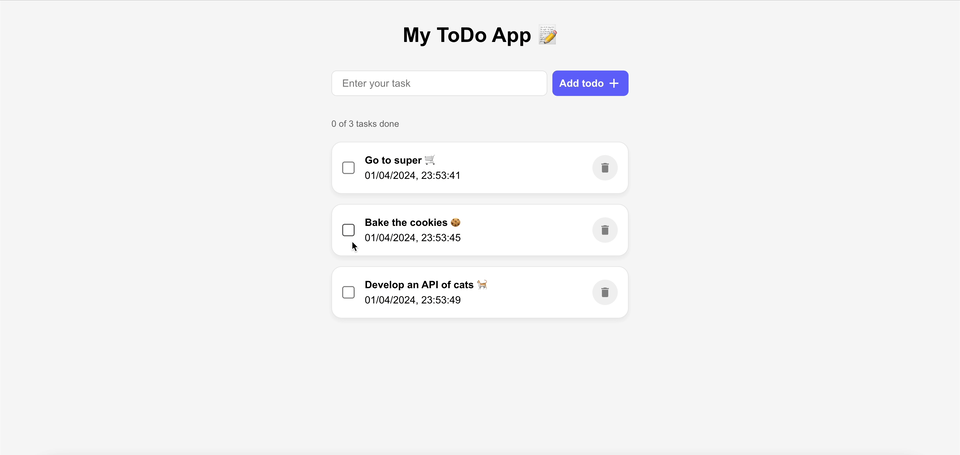

# To do App (Backend Repo)

This is the backend repo of the To Do app project. Is done following the structure of a REST API.

This project was an exercise proposed by the teachers at Nuclio School during the Full Stack Developer Bootcamp.

This To Do App enables the user to create, complete and delete to do tasks.

## Screenshots



## Tech Stack

**Client (not included in this repo):** React

**Server:** Node, Express

**DataBase:** MongoDB

## Installation

1. Clone the repository and navigate to the project directory.

```bash
  cd reto-5-todo-api-Ruben26rcz
```

2. Install MenuBot with npm

```bash
  npm install
```

3. Run the project in the terminal with the following command:

```bash
  npm run dev
```

4. Manage HTTP requests at http://localhost:3001.
